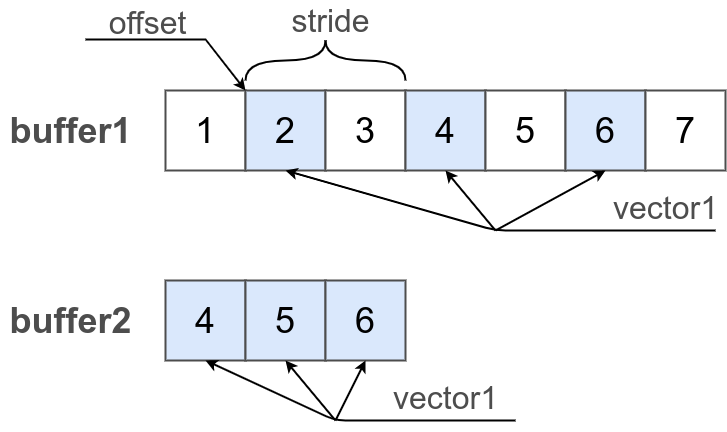

# Introduction

This article reviews the concept of a vector and its job formats.

The unique features of vector mathematics implementation of this module are:
- Cleanliness: The module does not inject methods, does not contaminate or alter the standard interface.
- Vector: is a regular array or typed buffer.
- The module uses the principles of functional programming.
  - The vector is not an object and has no fields "x", "y", "z".
  - All mathematical functions have an implementation that accepts vectors as arguments rather than contexts.
  - The adapter is a nonmutable object.
- The readability and conciseness of the code are as important as its speed.
- It has high flexibility due to the ability to initialize the vector by the adapter.
- It implements the same interface for different data types and formats of it initializing. The code written for the adapter does not differ from the code written for the array.
- The module has good test coverage and documentation.
- Under NodeJS, it uses an optional connection to native implementation of [BLAS-like](https://github.com/flame/blis) libraries (not ready).
- Optimized build has high performance (not ready).

### The concept vector

The vector in this module means an ordered set of scalars.

### The formats of vector declaration

The vector can be specified by

- an array ( Array )
- a typed buffer ( BufferTyped )
- an adapter ( VectorAdapter )

To use the vector in the form of an array or a buffer, use the namespace `_.avector`. To use the vector specified by the adapter, use the namespace `_.vectorAdapter`.

### Simple operation on vectors

A simple example of the operation of adding two vectors.

```js
var vector1 = [ 1, 2, 3 ];
var vector2 = [ 4, 5, 6 ];

_.avector.add( vector1, vector2 );

console.log( vector1 );
/* log : [ 5, 7, 9 ] */
console.log( vector2 );
/* log : [ 4, 5, 6 ] */
```

The `vector1` vector simultaneously used as a container to store the result and as one of the arguments of a mathematical function.

### The adapter is an abstraction

The vector can also be specified via an adapter. An adapter is a special object that is needed to make algorithms more abstract, and it uses the same code for very different formats of vector initializing.

```js
var array1 = [ 1, 2, 3 ];
var array2 = [ 4, 5, 6 ];
var vector1 = _.vectorAdapter.from( array1 );
var vector2 = _.vectorAdapter.from( array2 );

console.log( vector1.toStr() );
/* log : "1.000, 2.000, 3.000" */
console.log( vector2.toStr() );
/* log : "4.000, 5.000, 6.000" */

_.vectorAdapter.add( vector1, vector2 );

console.log( vector1.toStr() );
/* log : "5.000, 7.000, 9.000" */
console.log( vector2.toStr() );
/* log : "4.000, 5.000, 6.000" */

console.log( array1 );
/* log : [ 5, 7, 9 ] */
console.log( array2 );
/* log : [ 4, 5, 6 ] */

```

We create arrays `array1` and `array2`. For them, we set simple adapters `vector1` and `vector2`. We add vectors by using adapters. We see that not only the value of `vector1` but also the value of `array1` has changed.

Important: Adapters do not have data. Metaphorically, the adapter is an advanced kind of link on data.

### An adapter is a kind of link

Another example with an adapter is the multiplication of a vector by a scalar.

```js
var array = [ 1, 2, 3 ];
var vector1 = _.vectorAdapter.from( array );

_.avector.mul( array, 2 );

console.log( vector1.toStr() );
/* log : "2.000, 4.000, 6.000" */
```

The adapter `vector1` does not make a copy of the vector but is a link to the data of the original array `array`. After multiplying the array, the adapter has a value of 2 times greater than the original.

### An adapter is an interpretation

Another technical metaphor is interpretation. The adapter does not own the data, but points to it and specifies a way to interpret it.

### Alternative interfaces

This example shows 3 alternative ways to use the same interface.

```js

var array1 = [ 1, 2, 3 ];
var adapter1 = _.vectorAdapter.from( array1 );

_.avector.mul( array1, 2 );
_.vectorAdapter.mul( adapter1, 2 );
adapter1.mul( 2 );

console.log( adapter1.toStr() );
/* log : "8.000, 16.000, 24.000" */

```

Three consecutive multiplication of a vector using the data container `array1`, using the adapter `adapter1` and using the adapter method `adapter1.mul()`  8 times increase the value of all vector elements.

### Convention dst=null

Set the value of the first argument to `null` ( `dst = null` ), and then the result of the operation will be written to the new vector.

```js

var srcVector1 = [ 1, 2, 3 ];
var srcVector2 = [ 4, 5, 6 ];
var dstVector = _.avector.add( null, srcVector1, srcVector2 );

console.log( srcVector1 );
/* log : [ 1, 2, 3 ] */
console.log( srcVector2 );
/* log : [ 4, 5, 6 ] */
console.log( dstVector );
/* log : [ 5, 7, 9 ] */
console.log( dstVector === srcVector1 );
/* log : false */

```

Given that the first argument to the call `_.avector.add`  is` null`, a new container is created. The container has an input argument type. It is used to record the result of adding two vectors `srcVector1` and` srcVector2`. It records the result.

The same convention applies to all adapters and all routines of the `MathVector` module.

### Advantage of using adapters

Since an adapter is an implementation of an abstract interface, it can be any implementation. Changing the vector implementation will not affect the vector algorithms.

### Adapter from range

Let's say there is a large typed `Float32` buffer `buffer1` in length in gigabytes and a second buffer `buffer2` in length in megabytes. Somewhere in the first buffer, with some offset, a vector is hidden. We interpret the entire second buffer as a vector. How to multiply the first vector by the second while saving the result in the first buffer?

```js

var buffer1 = new F32x([ 1, 2, 3, 4, 5, 6, 7 ]);
var buffer2 = new F32x([ 4, 5, 6 ]);
var vector1 = _.vectorAdapter.from( buffer1, 1, 3 );
var vector2 = _.vectorAdapter.from( buffer2 );

console.log( vector1.toStr() );
/* log : "2.000, 3.000, 4.000" */
console.log( vector2.toStr() );
/* log : "4.000, 5.000, 6.000" */

_.vectorAdapter.add( vector1, vector2 );

console.log( vector1.toStr() );
/* log : "6.000, 8.000, 10.000" */
console.log( vector2.toStr() );
/* log : "4.000, 5.000, 6.000" */

console.log( vector1 );
/* log : [ 1, 6, 8, 10, 5, 6, 7 ] */
console.log( vector2 );
/* log : [ 4, 5, 6 ] */

```

When creating the adapter `vector1` from the buffer` buffer1`, we pass the offset to the `1` element and specify that the vector has a `3` element length. We interpret the entire second buffer as a vector. The result of the add operation is written to the vector `vector1`. Since the adapter was created from elements 1 - 3 of the buffer `buffer1`, the values of all elements outside this range remained unchanged.

### Comparison with standard typed buffers

You can also achieve this [by setting offset](https://developer.mozilla.org/en-US/docs/Web/JavaScript/Reference/Global_Objects/TypedArray/byteOffset) and [size](https://developer.mozilla.org/en-US/docs/Web/JavaScript/Reference/Global_Objects/TypedArray/byteLength) typed buffer ( BufferTyped ) when constructing it from a non-typed buffer ( BufferRaw ). But that's where the standard views come to an end. Standard views do not allow:

- Set step stride.
- Change direction.
- Specify a complex data format.
- Use array or arguments array as the original data container, only the untyped array.

### Specify step stride

An example is similar to the previous one. There is a large typed `Float32` buffer` buffer1` in length in gigabytes and a second buffer `buffer2` in length in megabytes. Somewhere in the first buffer, with some offset, a vector is hidden. We interpret the entire second buffer as a vector. How to multiply the first vector by the second while saving the result in the first buffer? But this time, suppose that the vector in the first buffer not only does not start from the beginning but does not go in sequence. Suppose a vector `vector1` has a width of step 2. That is, each subsequent element of the vector` vector1` is in the buffer `buffer1` through one.

```js

var buffer1 = new F32x([ 1, 2, 3, 4, 5, 6, 7 ]);
var buffer2 = new F32x([ 4, 5, 6 ]);
var vector1 = _.vectorAdapter.fromLongLrangeAndStride( buffer1, 1, 3, 2 );
var vector2 = _.vectorAdapter.from( buffer2 );

console.log( vector1.toStr() );
/* log : "2.000, 4.000, 6.000" */
console.log( vector2.toStr() );
/* log : "4.000, 5.000, 6.000" */

_.vectorAdapter.add( vector1, vector2 );

console.log( vector1.toStr() );
/* log : "6.000, 9.000, 12.000" */
console.log( vector2.toStr() );
/* log : "4.000, 5.000, 6.000" */

console.log( vector1 );
/* log : [ 1, 6, 3, 9, 5, 12, 7 ] */
console.log( vector2 );
/* log : [ 4, 5, 6 ] */
```

The routine `_.vectorAdapter.fromLongLrangeAndStride` creates an adapter `vector1` with an offset of `1` element, length of` 3` element and step width of `2` element. Adding vector `vector2` to vector` vector1`.



The figure shows how buffers `buffer1` and` buffer2` are placed in RAM. The adapter `vector1` uses part of the elements of `buffer1` starting with the first element. The vector has step `2` and includes `3` elements. The `vector2` adapter uses the entire` buffer2` buffer, the vector consists of `3` elements.

### Mixing different types of vectors

Vectors with different types of elements can be mixed.

The following types are supported:

- `Array`;
- `ArgumentsArray`;
- `Number`;
- `I8x` ( `Int8Array` );
- `U8x` ( `Ui8Array` );
- `U8ClampedX` ( `Ui8ClampedArray` );
- `I16x` ( `Int16Array` );
- `U16x` ( `Ui16Array` );
- `I32x` ( `Int32Array` );
- `U32x` ( `Ui32Array` );
- `F32x` ( `Float32Array` );
- `F64x` ( `Float64Array` );
- `I64x` ( `BigInt64Array` );
- `U64x` ( `BigUint64Array` ).

### Mixing vector formats

The routines of namespace `_.avector` can work with both adapters and standard types.

The routines of namespace `_.vectorAdapter` throws an error when trying to pass them a non-adapter.

### Adapter interface

The adapter interface implements the minimum set of methods and fields required to operate the vector. These include:

- The method `eGet( i )` ( from "element get" ) is intended to get the value of the i-th element.
- The method `eSet( i, e )` ( from "element set" ) is intended to set the value of i-th element.
- The field `length` is a length of vector, the quantity of elements.

### An example of creating a complex vector format

The format in which the vector is specified is hidden behind the abstract interface so it can have any complexity, and its implementation details are irrelevant for the algorithms of the module `MathVector`.

For example, the number can be interpreted as a vector of arbitrary length.

```js

var vector1 = _.vectorAdapter.fromNumber( 1, 3 );
var vector2 = _.vectorAdapter.from([ 4, 5, 6 ]);

console.log( vector1.toStr() );
/* log : [ 1, 1, 1 ] */
console.log( vector2.toStr() );
/* log : [ 4, 5, 6 ] */

_.vectorAdapter.add( vector2, vector1 );

console.log( vector1.toStr() );
/* log : [ 1, 1, 1 ] */
console.log( vector2.toStr() );
/* log : [ 5, 6, 7 ] */

```

The adapter `vector1` is created from a number. All values of vector `vector1` have values `1`, and its length is `3` elements. Adding vector `vector1` to vector` vector2` has the same effects as adding scalar `1` to vector `vector2`.

The example should demonstrate the flexibility of the vector adapters.

### Converting to Long type

Use the routine `_.avector.toLong()` to convert the adapter to the `Long` type. The routine `toLong` returns the original behind the adapter, if it possible, otherwise creates a new container of the same type as the original that filled by the content of vector.

```js

var long1 = new F32x([ 0, 1, 2, 3, 4, 5, 6, 7, 8, 9 ]);
var vector1 = _.vectorAdapter.fromLongLrangeAndStride( long1, 1, 3, 2 );
var long2 = _.avector.toLong( vector1 );

console.log( long2 );
/* log : [ 1, 3, 5 ] */
console.log( _.strType( long2 ) );
/* log : Float32Array */
```

### Summary

- The module has 2 namespaces - `_.avector` and` _.vectorAdapter`.
- The routines of namespace `_.avector` work with vectors in the form of `Long`-containers.
- The routines of namespace `_.vectorAdapter` is intended to work with adapters.
- Adapters are an abstraction, a kind of link that defines how data is interpreted.
- Adapters do not have data, do not directly contain vector data, only metadata - link to data, vector start, length, type, etc.
- The adapter can not only select the buffer span to be interpreted as a vector but also specify a stride.
- `null` in the first argument changes the semantics of the routine, forcing it to create a new container.
- The implementations of the adapter interface can have arbitrary complexity.

[Back to content](../README.md#Tutorials)
