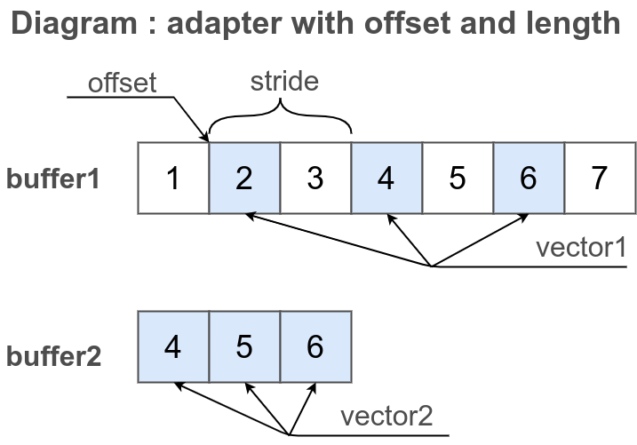

# Введення

В даній статті виконується огляд концепції вектора та його форм задання.

### Чому?

Математичні алгоритми мають бути незалежними від типу даних і формату вектора. Цей модуль обертається накого цього принципу.

Особливостями реалізації математики над векторами цього модуля є:

- **Чистота**: модуль не здійснює інжекцію методів, не забруднює і не змінює стандатрний інтерфейс.
- **Принцип zero-copy**: модуль робить можливим уникнути зайвих пересувань пам'яті завдяки концепції адаптерів.
- **Простота**: як вектор може інтерпретуватися звичайний масив або типізований буфер.
- **Зручність використання**: читабельність та лаконічність коду, що використовує цей модуль, є так само важливою для нас, як швидкодійність цього модуля.
- **Гнучкість**: володіє великою гнучкістю завдяки можливості задати вектор через адаптер. Ви можете написати і використовувати вашу власну реалізацію вектор адаптерів.
- **Застосовність**: реалізує один і той самий інтерфейс для різним типів даних і форми їх задання. Код написаний для адаптера не відрізняється від коду написаного для масиву.
- **Надійність**: має хороше тестове покриття.
- **Доступність**: має документацію.
- **Функціональне програмування**: модуль використовує принципи функціонального програмування.
  - Вектор є не об'єктом, а абстракцією.
  - Реалізації векторів не мають полів "x", "y", "z".
  - Всі математичні функції мають реалізацію, що приймає вектори в якості аргументів, а не контексту.
  - Адаптер - незмінюваний ( nonmutable ) об'єкт.
- **Нативна реалізація**: під NodeJS опціонально використовує зв'язку із нативною реалізацією [BLAS-like](https://github.com/flame/blis) бібліотеки ( не готово ).
- **GPGPU реалізація**: під браузером опціонально використовує WebGL.
- **Швидкодійність**: в оптимізованій збірці має високу швидкодійність ( не готово ).

### Концепція вектор та вектора адаптера

Під вектором в даному модулі розуміється впорядкована сукупність скалярів. Вектор не є об'єктом, а абстракцією.

Вектор адаптер - це реалізація абстрактного інтерфейса, різновид посилання, що задає спосіб інтерпретації даних, як вектора. Інтерфейс адаптера має багато реалізацій.

### Форми задання вектора

Вектор може бути заданий через

- через масив( Array )
- через типізований буфер ( BufferTyped )
- через адаптер ( VectorAdapter )

Для використання вектора в масиві або буфері використовуйте неймспейс `_.vector`. Для використання вектора заданого адаптером використовуйте неймспейс `_.vectorAdapter`.

```js

var array = [ 1, 2, 3 ];
var buffer = new F32x([ 1, 2, 3 ]);
var vad = _.vad.from([ 1, 2, 3 ]);

console.log( 'arrayIs( array ) :', _.arrayIs( array ) );
/* log : arrayIs( array ) : true */
console.log( 'arrayIs( buffer ) :', _.arrayIs( buffer ) );
/* log : arrayIs( buffer ) : false */
console.log( 'arrayIs( vad ) :', _.arrayIs( vad ) );
/* log : arrayIs( vad ) : false */
console.log( '' )

console.log( 'longIs( array ) :', _.longIs( array ) );
/* log : longIs( array ) : true */
console.log( 'longIs( buffer ) :', _.longIs( buffer ) );
/* log : longIs( buffer ) : true */
console.log( 'longIs( vad ) :', _.longIs( vad ) );
/* log : longIs( vad ) : false */
console.log( '' )

console.log( 'vectorIs( array ) :', _.vectorIs( array ) );
/* log : vectorIs( array ) : true */
console.log( 'vectorIs( buffer ) :', _.vectorIs( buffer ) );
/* log : vectorIs( buffer ) : true */
console.log( 'vectorIs( vad ) :', _.vectorIs( vad ) );
/* log : vectorIs( vad ) : true */
console.log( '' )

```

Перевірка `arrayIs()` повертає `true` лише для `array`. Перевірка `longIs()` повертає `true` для `array` та `buffer`. Але перевірка `vectorIs()` повертає `true` для всіх форм задання вектора.

### Проста операція над векторами

Простий приклад операції додавання двох векторів.

```js
var vector1 = [ 1, 2, 3 ];
var vector2 = [ 4, 5, 6 ];

_.vector.add( vector1, vector2 );

console.log( 'vector1 :', vector1 );
/* log : vector1 [ 5, 7, 9 ] */
console.log( 'vector2 :', vector2 );
/* log : vector2 : [ 4, 5, 6 ] */
```

Вектор `vector1` використовується одночасно і як контейнер для зберігання результату і як один із аргументів математичної функції.

### Адаптер це абстракція

Вектор може бути заданий і через адаптер. Адаптер це спеціальний об'єкт, який потрібний для того щоб зробити алгоритми більш абстрактними і використовувати один і той же код для дуже різних форм задання вектора.

```js
var array1 = [ 1, 2, 3 ];
var array2 = [ 4, 5, 6 ];
var vector1 = _.vectorAdapter.from( array1 );
var vector2 = _.vectorAdapter.from( array2 );

console.log( 'vector1 :', vector1 );
/* log : vector1 :  VectorAdapter.x3.Array :: 1.000 2.000 3.000 */
console.log( 'vector2 :', vector2 );
/* log : vector2 :  VectorAdapter.x3.Array :: 4.000 5.000 6.000 */

_.vectorAdapter.add( vector1, vector2 );

console.log( 'vector1 :', vector1 );
/* log : vector1 :  VectorAdapter.x3.Array :: 5.000 7.000 9.000 */
console.log( 'vector2 :', vector2 );
/* log : vector2 :  VectorAdapter.x3.Array :: 4.000 5.000 6.000 */

console.log( 'array1 :', array1 );
/* log : array1 : [ 5, 7, 9 ] */
console.log( 'array2 :', array2 );
/* log : array2 : [ 4, 5, 6 ] */
```

Створюється масиви `array1` та `array2`. Для них задаються прості адаптери `vector1` та `vector2`. Вектора `vecotr2` додається до вектора `vector1`. Бачимо, що змінилося не лише значення `vector1`, а й значення `array1`.

Важливо: адаптери не володіють даними. Матефорично кажучи, адаптер є продвинутим різновидом лінка на дані.

### Адаптер це різновид посилання.

Інший приклад із адаптером: множення вектора на скаляр.

```js
var array = [ 1, 2, 3 ];
var vector1 = _.vectorAdapter.from( array );

_.vector.mul( array, 2 );

console.log( 'vector1 :', vector1 );
/* log : vector1 :  VectorAdapter.x3.Array :: 2.000, 4.000, 6.000 */
```

Адаптер `vector1` не створює копії вектора, а є посиланням на дані оригінального масива `array`. Тому після виконання операції множення над масивом адаптер має значення в 2 рази більші від початкового.

### Адаптер це інтерпретація

Інша технічна метафора - інтерпретація. Адаптер не володіє даними, а вказує на них і задає спосіб їх інтерпретації.

### Альтернативні інтерфейси

В даному прикладі показано 3 альтернативних способи використання одного й того ж інтерфейсу.

```js
var array1 = [ 1, 2, 3 ];
var adapter1 = _.vectorAdapter.from( array1 );

_.vector.mul( array1, 2 );
_.vectorAdapter.mul( adapter1, 2 );
adapter1.mul( 2 );

console.log( 'adapter1 :', adapter1 );
/* log : adapter1 :  VectorAdapter.x3.Array :: 8.000, 16.000, 24.000 */
```

Три послідовні операції множення вектора з використанням контейнера даних `array1`, з використанням адаптера `adapter1` і з використанням метода `adapter1.mul()` адаптера збільшують значення всіх елементів вектора в 8 разів.

### Конвенція dst=null

Задайте значення першого аргумента як `null` ( `dst = null` ) щоб записати результат операції в новий вектор.

```js
var srcVector1 = [ 1, 2, 3 ];
var srcVector2 = [ 4, 5, 6 ];
var dstVector = _.vector.add( null, srcVector1, srcVector2 );

console.log( 'srcVector1 :', srcVector1 );
/* log : srcVector1 : [ 1, 2, 3 ] */
console.log( 'srcVector2 :', srcVector2 );
/* log : srcVector2 : [ 4, 5, 6 ] */
console.log( 'dstVector :', dstVector );
/* log : dstVector : [ 5, 7, 9 ] */
console.log( 'dstVector === srcVector1 :', dstVector === srcVector1 );
/* log : dstVector === srcVector1 : false */
```

Так, як першим аргументом виклику `_.vector.add` є `null` то для запису результату додавання двох векторів `srcVector1` та `srcVector2` створюється новий контейнер такого ж типу `Array` як і вхідні аргументи, й в нього записується результат.

Така ж конвенція діє для всіх адаптерів та для всіх рутин модуля `MathVector`.

### Перевага використання адаптерів

Вектора адаптер це абстрактний інтервейс із багатьма дуже різними реалізаціями. Зміна в реалізації адаптера ніяк не впливає на алгоритми на векторах. Ви можете реалізувати вашу власну реалізацію адаптерів, й алгоритми реалізовані в цьому модулі залишаться застовними до вашої реалізації адаптера. В цьому полягає гнучкість вектор адаптерів.

Іншою силою використання вектор адаптерів є застосування принципу програмування [zero-copy](https://en.wikipedia.org/wiki/Zero-copy) на практиці. Завдяки вектор адаптерам зникає необхідність копіювати ділянки пам'яті з бінарного файла для того щоб застовувати якусь математику до його вміст. Ви визначаєте адаптер і викликаєте потрібний алгоритм, передачюи адаптери в як аргументи. Не відбувається ніякого зайвого копіювання даних.

### Адаптер з області ( range )

Скажімо є довгий типізований `Float32` буфер `buffer1` довжиною в гігабайт й другий буфер `buffer2` довжиною в мегабайт. Десь в першому буфері, з якимось зсувом, захований вектор. Увесь другий буфер інтерпретуємо, як вектор. Як здійснити множення першого вектора на другий із збереженням результату в першому буфері? Як уникнути непотрібного копіювання мегабайт даних із одного місця в інше під час використання математичних алгоритмів?

```js
var buffer1 = new F32x([ 1, 2, 3, 4, 5, 6, 7 ]);
var buffer2 = new F32x([ 4, 5, 6 ]);
var vector1 = _.vectorAdapter.from( buffer1, 1, 3 );
var vector2 = _.vectorAdapter.from( buffer2 );

console.log( 'vector1 :', vector1 );
/* log : vector1 :  VectorAdapter.x3.F32x :: 2.000, 3.000, 4.000 */
console.log( 'vector2 :', vector2 );
/* log : vector2 :  VectorAdapter.x3.F32x :: 4.000, 5.000, 6.000 */

_.vectorAdapter.add( vector1, vector2 );

console.log( 'vector1 :', vector1 );
/* log : vector1 :  VectorAdapter.x3.F32x :: 6.000, 8.000, 10.000 */
console.log( 'vector2 :', vector2 );
/* log : vector2 :  VectorAdapter.x3.F32x :: 4.000, 5.000, 6.000 */

console.log( 'buffer1 :', buffer1 );
/* log : buffer1 : [ 1, 6, 8, 10, 5, 6, 7 ] */
console.log( 'buffer2 :', buffer2 );
/* log : buffer2 : [ 4, 5, 6 ] */
```

При створенні адаптера `vector1` до буфера `buffer1` передаємо зсув в `1` елемент та задаємо, що вектор має довжину `3` елемента. Увесь другий буфер інтерпретуємо, як вектор. Результат операції додавання записується в вектор `vector1`. Так, як адаптер було створено із елементів 1 - 3 буфера `buffer1` то значення всіх елементів за межами цієї області ( range ) залишилися без змін.


На рисунку показано логіку інтерпретування частини бефера, як вектора. Створений адаптер `vector1` використовує три елемента буфера `buffer1` не починаючи з першого. Адаптер `vector2` використовує весь буфер `buffer2`, і теж має довжину `3` елементи.

### Порівняння із стандатними типізованими буферами

Цього ж можна досягти й задаючи [зсув](https://developer.mozilla.org/en-US/docs/Web/JavaScript/Reference/Global_Objects/TypedArray/byteOffset) та [розмір](https://developer.mozilla.org/en-US/docs/Web/JavaScript/Reference/Global_Objects/TypedArray/byteLength) типізованого буфера ( BufferTyped ) при його конструюванні із нетипізованого буфера ( BufferRaw ). Але на цьому гнучкість стандартних представлень завершуються. Стандатьні представлення не дають можливості:

- Задати ширини кроку ( stride ).
- Змінити напрямок.
- Задати комплексний формат даних.
- Використати масив або масив аргументів як оригінальний контейнер даних, лише нетипізований буфер.

### Задання ширини кроку ( stride )

Приклад подібний до попереднього. Є довгий типізований `Float32` буфер `buffer1` довжиною в гігабайт й другий буфер `buffer2` довжиною в мегабайт. Десь в першому буфері, з якимось зсувом, захований вектор. Увесь другий буфер інтерпретуємо, як вектор. Як здійснити множення першого вектора на другий із збереженням результату в першому буфері? Але цього разу припустимо, що вектор в першому буфері не лише не починається із початку, але й не йде послідовно. Припустимо вектора `vector1` має ширину кроку 2. Тобто кожен наступний елемент вектора `vector1` знаходиться в буфері `buffer1` через один.

```js
var buffer1 = new F32x([ 1, 2, 3, 4, 5, 6, 7 ]);
var buffer2 = new F32x([ 4, 5, 6 ]);
var vector1 = _.vectorAdapter.fromLongLrangeAndStride( buffer1, 1, 3, 2 );
var vector2 = _.vectorAdapter.from( buffer2 );

console.log( 'vector1 :', vector1 );
/* log : vector1 :  VectorAdapter.x3.F32x :: 2.000, 4.000, 6.000 */
console.log( 'vector2 :', vector2 );
/* log : vector1 :  VectorAdapter.x3.F32x :: 4.000, 5.000, 6.000 */

_.vectorAdapter.add( vector1, vector2 );

console.log( 'vector1 :', vector1 );
/* log : vector1 :  VectorAdapter.x3.F32x :: 6.000, 9.000, 12.000 */
console.log( 'vector2 :', vector2 );
/* log : vector2 :  VectorAdapter.x3.F32x :: 4.000, 5.000, 6.000 */

console.log( 'vector1 :', vector1 );
/* log : vector1 : [ 1, 6, 3, 9, 5, 12, 7 ] */
console.log( 'vector2 :', vector2 );
/* log : vector2 : [ 4, 5, 6 ] */
```

Рутина `_.vectorAdapter.fromLongLrangeAndStride` створює адаптер `vector1` із зсувом `1` елемент, довжиною `3` елементи та шириною кроку `2` елементи. Далі додавання вектора `vector2` до вектора `vector1`.



На рисунку показано логіку інтерпретування частини бефера, як вектора із заданням ширини кроку. Створений адаптер `vector1` використовує частину елементів буфера `buffer1` через один. Адаптер цього вектора має ширину кроку `2` елменти та включає `3` елемента. Адаптер `vector2` використовує весь буфер `buffer2`, і також має довжину `3` елементи.

### Змішування різних типів векторів

Вектори з різними типами елементів можливо змішувати.

Підтримуються такі типи:

- `Array`;
- `ArgumentsArray`;
- `Number`;
- `I8x` ( `Int8Array` );
- `U8x` ( `Ui8Array` );
- `U8ClampedX` ( `Ui8ClampedArray` );
- `I16x` ( `Int16Array` );
- `U16x` ( `Ui16Array` );
- `I32x` ( `Int32Array` );
- `U32x` ( `Ui32Array` );
- `F32x` ( `Float32Array` );
- `F64x` ( `Float64Array` );
- `I64x` ( `BigInt64Array` );
- `U64x` ( `BigUint64Array` ).

### Змішування форм векторів

Рутини неймспейсу `_.vector` можуть працювати як з адаптерами так і з стандартними типами.

Рутини неймспейса `_.vectorAdapter` викидуються помилку при при спробі передати їм не адаптер.

### Інтерфейс адапатера

Інтерфейс адаптера реалізує мінімалну множину методів і полів необхідних для оперування вектором. Серед таких:

- Метод `eGet( i )` - від "element get" для того щоб отримати значення i-го елемента.
- Метод `eSet( i, e )` - від "element set" для того щоб всановити значення i-го елемента.
- Поле `length` - довжина вектора в елементах.

### Приклад складного формату задання вектора

Формат в якому задається вектор захований за абстрактним інтерфейсом тому він може мати будm-яку складніст і його деталі реалізації не мають значення для алгоритмів модуля `MathVector`.

Для прикладу число можливо інтерпретувати, як вектор довільної довжини.

```js
var vector1 = _.vectorAdapter.fromNumber( 1, 3 );
var vector2 = _.vectorAdapter.from([ 4, 5, 6 ]);

console.log( 'vector1 :', vector1 );
/* log : vector1 :  VectorAdapter.x3.F32x :: 1.000, 1.000, 1.000 */
console.log( 'vector2 :', vector2 );
/* log : vector1 :  VectorAdapter.x3.Array :: 4.000, 5.000, 6.000 */

_.vectorAdapter.add( vector2, vector1 );

console.log( 'vector1 :', vector1 );
/* log : vector1 :  VectorAdapter.x3.F32x :: 1.000, 1.000, 1.000 */
console.log( 'vector2 :', vector2 );
/* log : vector2 :  VectorAdapter.x3.Array :: 5.000, 6.000, 7.000 */
```

Адаптер `vector1` створюється із числа. Всі значення вектора `vector1` мають значення `1`, а його довжина `3` елементи. Додавання вектору `vector1` до вектору `vector2` має такий же ефекти які додавання скаляра `1` до вектору `vector2`.

Приклад має продемонструвати гнучкість вектор адаптерів.

### Приведення до типу Long

Для того щоб конвертувати адаптер в тип `Long` використайте рутину `_.vector.toLong()`. Рутина `toLong` повертає оригінал, що стоїть за адаптером якщо це можливо, інакше створює новий контейнер такого ж типу, як і оригінал із вектором у вмісті.

```js
var long1 = new F32x([ 0, 1, 2, 3, 4, 5, 6, 7, 8, 9 ]);
var vector1 = _.vectorAdapter.fromLongLrangeAndStride( long1, 1, 3, 2 );
var long2 = _.vector.toLong( vector1 );

console.log( 'long2 :', long2 );
/* log : long2 : [ 1, 3, 5 ] */
console.log( 'long2 type :', _.entity.strType( long2 ) );
/* log : long2 type : Float32Array */
```

### Підсумок

- `null` в першому аргументі змінює семантику рутини, примушуючи її створити новий контейнер.
- Модуль має 2 неймспеси: `_.vector` i `_.vectorAdapter`.
- Рутини неймспесу `_.vector` працюють з векторами у вигляді `Long`-контейнерів.
- Рутини неймспесу `_.vectorAdapter` працюють із векторами в  формі адаптерів.
- Вектор адаптер - це абстракція, різновид посилання, що задає спосіб інтерпретації даних, як вектора.
- Адаптери не володіють даними, не містять безпосередньо даних вектора, а лише метадані - лінк на дані, початок вектору, довжину, тип, тощо.
- Адаптером можливо не лише вибрати поміжок буфера, який потрібно інтерпретувати, як вектор, але й задати ширину крок ( stride ).
- Ви можете написати вашу власну реалізацію вектор адаптерів.

[Повернутись до змісту](../README.md#Туторіали)
